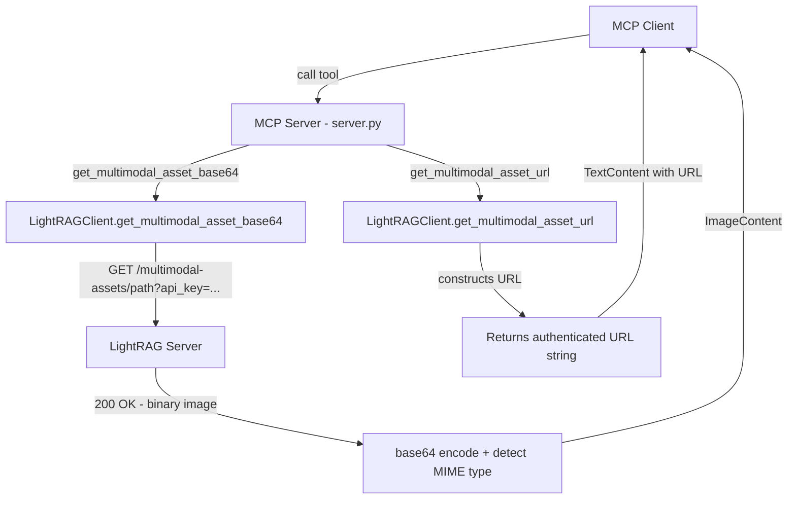
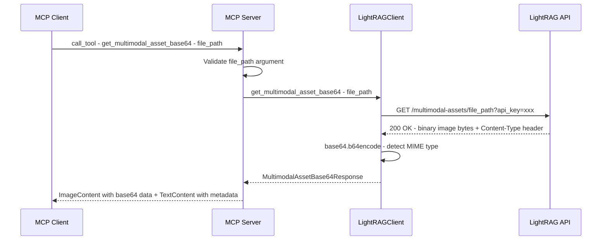
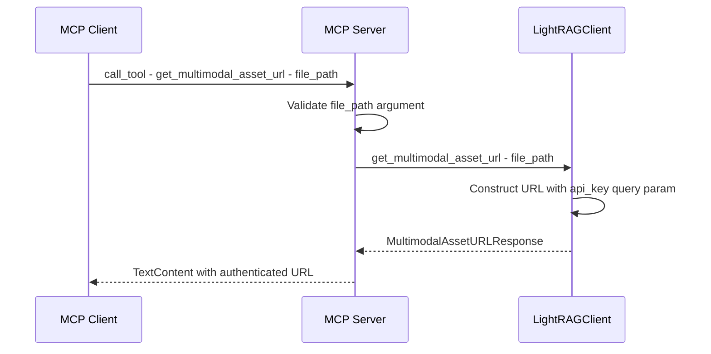

# Multimodal Asset Retrieval - Implementation Plan

## Summary

Add two new MCP tools to retrieve images extracted by MinerU during multimodal document processing via the LightRAG server's `/multimodal-assets/{file_path}` endpoint. The tools provide two modes of access:

1. **`get_multimodal_asset_base64`** — Fetches the image from the LightRAG server and returns it as base64-encoded data (default mode)
2. **`get_multimodal_asset_url`** — Returns the full authenticated URL for direct access to the image

A configuration variable `MULTIMODAL_ASSET_MODE` controls which tool is the "primary" recommendation, defaulting to `base64`.

---

## Architecture



---

## LightRAG Endpoint Reference

- **Path**: `GET /multimodal-assets/{file_path:path}`
- **Auth**: Query params `?token=<jwt>` or `?api_key=<key>`
- **Response**: Raw image bytes with auto-detected `Content-Type`
- **Supported extensions**: `.png`, `.jpg`, `.jpeg`, `.gif`, `.bmp`, `.webp`, `.svg`
- **Security**: Path traversal protection, file existence check
- **Availability**: Only when `ENABLE_MULTIMODAL=true` on the LightRAG server

---

## Environment Variables

| Variable | Default | Description |
|----------|---------|-------------|
| `MULTIMODAL_ASSET_MODE` | `base64` | Default mode: `base64` or `url`. Controls which tool description is marked as the recommended default. |

This variable is read in [`server.py`](src/daniel_lightrag_mcp/server.py) at tool registration time and influences tool descriptions only. Both tools are always available regardless of this setting.

---

## Changes by File

### 1. [`src/daniel_lightrag_mcp/models.py`](src/daniel_lightrag_mcp/models.py)

Add two new response models:

```python
class MultimodalAssetBase64Response(BaseModel):
    """Response model for base64-encoded multimodal asset retrieval."""
    file_path: str = Field(..., description="Relative path to the image file")
    mime_type: str = Field(..., description="MIME type of the image")
    data: str = Field(..., description="Base64-encoded image data")
    size_bytes: int = Field(..., description="Original file size in bytes")


class MultimodalAssetURLResponse(BaseModel):
    """Response model for multimodal asset URL retrieval."""
    file_path: str = Field(..., description="Relative path to the image file")
    url: str = Field(..., description="Full authenticated URL to access the image")
```

### 2. [`src/daniel_lightrag_mcp/client.py`](src/daniel_lightrag_mcp/client.py)

#### 2a. Add `_make_raw_request` method

A new private method similar to [`_make_request`](src/daniel_lightrag_mcp/client.py:136) but returns raw bytes instead of parsed JSON. This is needed because the `/multimodal-assets/` endpoint returns binary image data, not JSON.

```python
async def _make_raw_request(
    self,
    method: str,
    endpoint: str,
    params: Optional[Dict[str, Any]] = None,
) -> tuple[bytes, str]:
    """Make HTTP request expecting raw binary response.
    
    Returns:
        Tuple of (response_bytes, content_type)
    """
    url = f"{self.base_url}{endpoint}"
    # ... similar error handling to _make_request ...
    response = await self.client.get(url, params=params)
    response.raise_for_status()
    content_type = response.headers.get("content-type", "application/octet-stream")
    return response.content, content_type
```

#### 2b. Add `get_multimodal_asset_base64` method

```python
async def get_multimodal_asset_base64(self, file_path: str) -> MultimodalAssetBase64Response:
    """Fetch a multimodal asset and return it as base64-encoded data."""
    params = {}
    if self.api_key:
        params["api_key"] = self.api_key
    
    raw_bytes, content_type = await self._make_raw_request(
        "GET", f"/multimodal-assets/{file_path}", params=params
    )
    
    import base64
    encoded = base64.b64encode(raw_bytes).decode("utf-8")
    
    return MultimodalAssetBase64Response(
        file_path=file_path,
        mime_type=content_type,
        data=encoded,
        size_bytes=len(raw_bytes),
    )
```

#### 2c. Add `get_multimodal_asset_url` method

```python
async def get_multimodal_asset_url(self, file_path: str) -> MultimodalAssetURLResponse:
    """Construct the full authenticated URL for a multimodal asset."""
    from urllib.parse import urlencode
    
    base = f"{self.base_url}/multimodal-assets/{file_path}"
    if self.api_key:
        base += f"?{urlencode({'api_key': self.api_key})}"
    
    return MultimodalAssetURLResponse(
        file_path=file_path,
        url=base,
    )
```

### 3. [`src/daniel_lightrag_mcp/server.py`](src/daniel_lightrag_mcp/server.py)

#### 3a. Tool Registration in [`handle_list_tools`](src/daniel_lightrag_mcp/server.py:288)

Add a new "Multimodal Asset Tools" section after the System Management Tools:

```python
# Multimodal Asset Tools (2 tools)
tools.extend([
    Tool(
        name="get_multimodal_asset_base64",
        description="Fetch a multimodal asset image from LightRAG and return it as base64-encoded data. Use this for images extracted by MinerU during multimodal document processing. The file_path is the relative path within the multimodal output directory.",
        inputSchema={
            "type": "object",
            "properties": {
                "file_path": {
                    "type": "string",
                    "description": "Relative path to the image file within the multimodal output directory, e.g. doc/auto/images/figure1.png"
                }
            },
            "required": ["file_path"]
        }
    ),
    Tool(
        name="get_multimodal_asset_url",
        description="Get the full authenticated URL for a multimodal asset image from LightRAG. Returns a URL that can be used directly in img tags or markdown. The file_path is the relative path within the multimodal output directory.",
        inputSchema={
            "type": "object",
            "properties": {
                "file_path": {
                    "type": "string",
                    "description": "Relative path to the image file within the multimodal output directory, e.g. doc/auto/images/figure1.png"
                }
            },
            "required": ["file_path"]
        }
    ),
])
```

#### 3b. Tool Argument Validation in [`_validate_tool_arguments`](src/daniel_lightrag_mcp/server.py:57)

Add to the `required_args` dict:

```python
"get_multimodal_asset_base64": ["file_path"],
"get_multimodal_asset_url": ["file_path"],
```

#### 3c. Tool Handlers in [`handle_call_tool`](src/daniel_lightrag_mcp/server.py:788)

Add two new `elif` branches before the `else: Unknown tool` block:

- **`get_multimodal_asset_base64`**: Calls `lightrag_client.get_multimodal_asset_base64(file_path)`, then returns the result using MCP's [`ImageContent`](src/daniel_lightrag_mcp/server.py:19) type with the base64 data and MIME type. Also includes a [`TextContent`](src/daniel_lightrag_mcp/server.py:18) with metadata (file path, size).

- **`get_multimodal_asset_url`**: Calls `lightrag_client.get_multimodal_asset_url(file_path)`, returns a [`TextContent`](src/daniel_lightrag_mcp/server.py:18) with the URL.

For the base64 tool, the response uses MCP's native `ImageContent`:

```python
elif tool_name == "get_multimodal_asset_base64":
    file_path = arguments.get("file_path", "")
    # ... validation ...
    result = await lightrag_client.get_multimodal_asset_base64(file_path)
    return {
        "content": [
            {
                "type": "image",
                "data": result.data,
                "mimeType": result.mime_type,
            },
            {
                "type": "text",
                "text": json.dumps({
                    "file_path": result.file_path,
                    "mime_type": result.mime_type,
                    "size_bytes": result.size_bytes,
                }, indent=2)
            }
        ]
    }
```

### 4. [`src/daniel_lightrag_mcp/__init__.py`](src/daniel_lightrag_mcp/__init__.py)

Add new model exports:

```python
"MultimodalAssetBase64Response",
"MultimodalAssetURLResponse",
```

### 5. [`tests/test_server.py`](tests/test_server.py)

- Update tool count assertion from 22 to 24
- Add `get_multimodal_asset_base64` and `get_multimodal_asset_url` to expected tool lists
- Add test cases for the new tool handlers

### 6. [`tests/test_client.py`](tests/test_client.py)

- Add tests for `_make_raw_request` method
- Add tests for `get_multimodal_asset_base64` method
- Add tests for `get_multimodal_asset_url` method
- Test auth parameter inclusion in both methods

### 7. Documentation Updates

- [`README.md`](README.md): Add new tools to the tool listing, update tool count from 22 to 24
- [`CONFIGURATION_GUIDE.md`](CONFIGURATION_GUIDE.md): Add `MULTIMODAL_ASSET_MODE` env var
- [`MCP_CONFIGURATION_GUIDE.md`](MCP_CONFIGURATION_GUIDE.md): Add multimodal configuration section

---

## Data Flow

### Base64 Mode Flow



### URL Mode Flow



---

## Error Handling

| Scenario | Error Type | HTTP Status | MCP Response |
|----------|-----------|-------------|--------------|
| Empty file_path | `LightRAGValidationError` | N/A | Error response with validation message |
| File not found on server | `LightRAGAPIError` | 404 | Error response: File not found |
| Auth failure | `LightRAGAuthError` | 401/403 | Error response: Authentication required |
| Path traversal attempt | `LightRAGAuthError` | 403 | Error response: Access denied |
| Multimodal not enabled | `LightRAGAPIError` | 404 | Error response: Endpoint not available |
| Connection failure | `LightRAGConnectionError` | N/A | Error response: Connection failed |

---

## Testing Strategy

### Unit Tests

1. **Client tests** (`test_client.py`):
   - `test_make_raw_request_success` — Mock httpx to return binary data
   - `test_make_raw_request_with_auth` — Verify api_key is passed as query param
   - `test_make_raw_request_http_errors` — Test 401, 403, 404 error mapping
   - `test_get_multimodal_asset_base64_success` — Verify base64 encoding and MIME detection
   - `test_get_multimodal_asset_base64_no_auth` — Verify works without api_key
   - `test_get_multimodal_asset_url_with_auth` — Verify URL includes api_key
   - `test_get_multimodal_asset_url_no_auth` — Verify URL without api_key

2. **Server tests** (`test_server.py`):
   - `test_tool_count_updated` — Verify 24 tools listed
   - `test_multimodal_tools_listed` — Verify both tools appear in listing
   - `test_get_multimodal_asset_base64_handler` — Mock client, verify ImageContent response
   - `test_get_multimodal_asset_url_handler` — Mock client, verify TextContent response
   - `test_multimodal_validation_empty_path` — Verify validation rejects empty file_path
   - `test_multimodal_argument_validation` — Verify _validate_tool_arguments works

3. **Model tests** (`test_models.py`):
   - `test_multimodal_asset_base64_response` — Verify model creation and serialization
   - `test_multimodal_asset_url_response` — Verify model creation and serialization

---

## Implementation Order

1. Add models to [`models.py`](src/daniel_lightrag_mcp/models.py)
2. Add `_make_raw_request` to [`client.py`](src/daniel_lightrag_mcp/client.py)
3. Add `get_multimodal_asset_base64` and `get_multimodal_asset_url` to [`client.py`](src/daniel_lightrag_mcp/client.py)
4. Register tools in [`server.py`](src/daniel_lightrag_mcp/server.py) `handle_list_tools`
5. Add validation entries in [`server.py`](src/daniel_lightrag_mcp/server.py) `_validate_tool_arguments`
6. Add tool handlers in [`server.py`](src/daniel_lightrag_mcp/server.py) `handle_call_tool`
7. Update [`__init__.py`](src/daniel_lightrag_mcp/__init__.py) exports
8. Write tests
9. Update documentation
