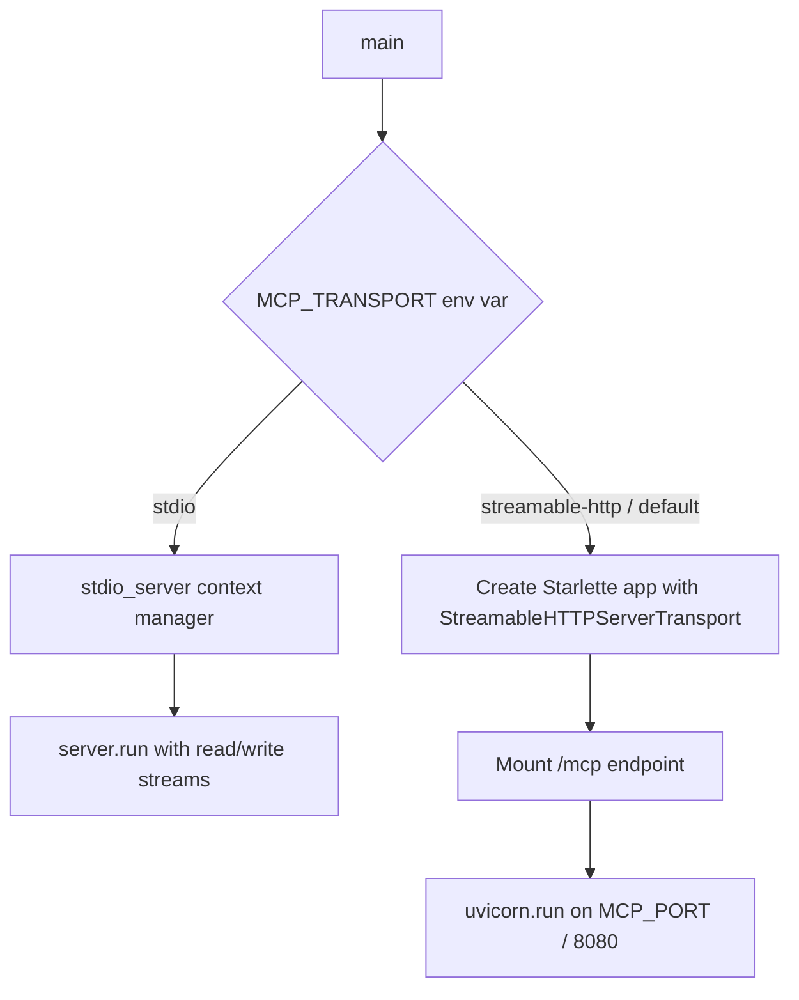
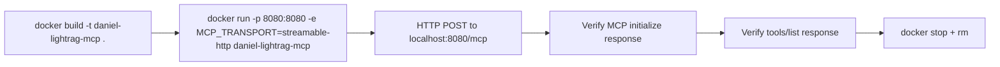

# Plan: Streamable HTTP MCP Transport

## Summary

Add Streamable HTTP transport support to the daniel-lightrag-mcp server using the official `mcp` Python SDK's built-in `StreamableHTTPServerTransport`. The server will support both STDIO and Streamable HTTP transports, selectable via the `MCP_TRANSPORT` environment variable, defaulting to `streamable-http`. The HTTP server will listen on port **8080**.

---

## Current State Analysis

### Architecture
- **Transport**: STDIO only, via [`mcp.server.stdio.stdio_server()`](src/daniel_lightrag_mcp/server.py:12)
- **Server object**: Global [`server = Server("daniel-lightrag-mcp")`](src/daniel_lightrag_mcp/server.py:51) with tool handlers registered at module level
- **Entry points**: [`cli.py:cli()`](src/daniel_lightrag_mcp/cli.py:10) → [`server.py:main()`](src/daniel_lightrag_mcp/server.py:2116) → `stdio_server()` context manager
- **Docker**: Exposes port 9621, runs `python -m daniel_lightrag_mcp` which calls `asyncio.run(main())`
- **Dependencies**: `mcp>=1.2.0`, `httpx>=0.24.0`, `pydantic>=2.0.0`, `anyio>=3.0.0`

### Known Issues
- [`__main__.py`](src/daniel_lightrag_mcp/__main__.py:7) imports `main` from `.cli` but [`cli.py`](src/daniel_lightrag_mcp/cli.py) only exports `cli()` — this is a bug
- Docker EXPOSE 9621 conflicts with `LIGHTRAG_BASE_URL` default (the upstream LightRAG API)
- `mcp>=1.2.0` version constraint is too low for Streamable HTTP support (needs `>=1.8.0`)

---

## Design

### Transport Selection Flow



### Environment Variables

| Variable | Default | Description |
|----------|---------|-------------|
| `MCP_TRANSPORT` | `streamable-http` | Transport type: `stdio` or `streamable-http` |
| `MCP_PORT` | `8080` | Port for Streamable HTTP server |
| `MCP_HOST` | `0.0.0.0` | Bind address for Streamable HTTP server |
| `LIGHTRAG_BASE_URL` | `http://localhost:9621` | Upstream LightRAG API URL (unchanged) |
| `LIGHTRAG_TIMEOUT` | `30` | HTTP client timeout (unchanged) |
| `LOG_LEVEL` | `INFO` | Log level (unchanged) |

### Official SDK Usage

The `mcp` Python SDK provides [`mcp.server.streamable_http.StreamableHTTPServerTransport`](https://github.com/modelcontextprotocol/python-sdk) which integrates with any ASGI framework. The recommended approach uses **Starlette** + **uvicorn**:

```python
from starlette.applications import Starlette
from starlette.routing import Mount
from mcp.server.streamable_http import StreamableHTTPServerTransport

transport = StreamableHTTPServerTransport(endpoint="/mcp")
app = Starlette(routes=[Mount("/mcp", app=transport.handle_request)])
```

---

## Implementation Steps

### Step 1: Update dependencies in `pyproject.toml`

**File**: [`pyproject.toml`](pyproject.toml)

- Bump `mcp>=1.2.0` → `mcp>=1.8.0` (Streamable HTTP support)
- Add `starlette>=0.27.0` dependency (ASGI framework for HTTP transport)
- Add `uvicorn>=0.23.0` dependency (ASGI server)

### Step 2: Fix `__main__.py` import bug

**File**: [`src/daniel_lightrag_mcp/__main__.py`](src/daniel_lightrag_mcp/__main__.py)

- Change `from .cli import main` → `from .cli import cli` and call `cli()` instead of `asyncio.run(main())`

### Step 3: Refactor `server.py:main()` to support both transports

**File**: [`src/daniel_lightrag_mcp/server.py`](src/daniel_lightrag_mcp/server.py)

Changes to the [`main()`](src/daniel_lightrag_mcp/server.py:2116) function:

1. Read `MCP_TRANSPORT` env var (default: `streamable-http`)
2. Read `MCP_PORT` env var (default: `8080`)
3. Read `MCP_HOST` env var (default: `0.0.0.0`)
4. Add new import: `from mcp.server.streamable_http import StreamableHTTPServerTransport`
5. Add new imports: `from starlette.applications import Starlette`, `from starlette.routing import Mount`, `import uvicorn`
6. Branch on transport type:
   - **stdio**: Keep existing `stdio_server()` logic unchanged
   - **streamable-http**: Create Starlette app with `StreamableHTTPServerTransport`, run via `uvicorn`

The key change is adding a new async function `run_streamable_http()` alongside the existing STDIO path:

```python
async def run_streamable_http(host: str, port: int):
    """Run the MCP server with Streamable HTTP transport."""
    from mcp.server.streamable_http import StreamableHTTPServerTransport
    from starlette.applications import Starlette
    from starlette.routing import Mount
    import uvicorn

    transport = StreamableHTTPServerTransport(endpoint="/mcp")
    app = Starlette(
        routes=[Mount("/mcp", app=transport.handle_request)],
        on_startup=[lambda: logger.info(f"MCP Streamable HTTP server on {host}:{port}/mcp")]
    )

    # Run server.run in background with transport streams
    async with transport.connect() as (read_stream, write_stream):
        server_task = asyncio.create_task(
            server.run(read_stream, write_stream, init_options)
        )
        config = uvicorn.Config(app, host=host, port=port, log_level="info")
        uvicorn_server = uvicorn.Server(config)
        await uvicorn_server.serve()
```

### Step 4: Update `cli.py` to accept transport arguments

**File**: [`src/daniel_lightrag_mcp/cli.py`](src/daniel_lightrag_mcp/cli.py)

- Add optional CLI arguments: `--transport`, `--port`, `--host`
- These override the corresponding env vars
- Pass them through to `main()`

### Step 5: Update Dockerfile

**File**: [`Dockerfile`](Dockerfile)

Changes:
1. Add `starlette` and `uvicorn` to the image (handled by pip install from pyproject.toml)
2. Change `EXPOSE 9621` → `EXPOSE 8080` (MCP HTTP port)
3. Add `ENV MCP_TRANSPORT=streamable-http`
4. Add `ENV MCP_PORT=8080`
5. Add `ENV MCP_HOST=0.0.0.0`
6. Update HEALTHCHECK to hit `http://localhost:8080/mcp` instead of just importing the module

### Step 6: Add transport-specific tests

**New file**: `tests/test_transport.py`

Tests to add:
- Test that `MCP_TRANSPORT=stdio` uses STDIO transport
- Test that `MCP_TRANSPORT=streamable-http` creates Starlette app
- Test that the `/mcp` endpoint responds to HTTP requests
- Test invalid transport value raises error
- Test port/host configuration from env vars

### Step 7: Add Docker-based integration test

**New file**: `tests/test_docker.py` (or extend `tests/test_integration.py`)

- Build Docker image using `docker build`
- Run container with `MCP_TRANSPORT=streamable-http`
- Send HTTP request to `http://localhost:8080/mcp` to verify the server responds
- Verify MCP protocol handshake works over HTTP
- Clean up container after test

### Step 8: Update `__init__.py` exports

**File**: [`src/daniel_lightrag_mcp/__init__.py`](src/daniel_lightrag_mcp/__init__.py)

- No changes needed to exports (transport is an internal concern)

### Step 9: Update documentation

**Files**: [`README.md`](README.md), [`CONFIGURATION_GUIDE.md`](CONFIGURATION_GUIDE.md), [`MCP_CONFIGURATION_GUIDE.md`](MCP_CONFIGURATION_GUIDE.md)

- Document the new `MCP_TRANSPORT`, `MCP_PORT`, `MCP_HOST` env vars
- Add Streamable HTTP usage examples
- Update Docker run examples to include port mapping `-p 8080:8080`
- Document the `/mcp` endpoint

---

## File Change Summary

| File | Action | Description |
|------|--------|-------------|
| [`pyproject.toml`](pyproject.toml) | Modify | Bump mcp version, add starlette + uvicorn deps |
| [`src/daniel_lightrag_mcp/__main__.py`](src/daniel_lightrag_mcp/__main__.py) | Modify | Fix import bug |
| [`src/daniel_lightrag_mcp/server.py`](src/daniel_lightrag_mcp/server.py) | Modify | Add Streamable HTTP transport path in main() |
| [`src/daniel_lightrag_mcp/cli.py`](src/daniel_lightrag_mcp/cli.py) | Modify | Add --transport/--port/--host CLI args |
| [`Dockerfile`](Dockerfile) | Modify | Update EXPOSE, ENV vars, HEALTHCHECK |
| `tests/test_transport.py` | Create | Transport selection and HTTP endpoint tests |
| `tests/test_docker.py` | Create | Docker-based integration tests |
| [`README.md`](README.md) | Modify | Document new transport options |
| [`CONFIGURATION_GUIDE.md`](CONFIGURATION_GUIDE.md) | Modify | Document new env vars |
| [`MCP_CONFIGURATION_GUIDE.md`](MCP_CONFIGURATION_GUIDE.md) | Modify | Update MCP client config examples |

---

## Docker Testing Strategy



The Docker test will:
1. Build the image from the project Dockerfile
2. Start a container with Streamable HTTP transport
3. Use `httpx` or the MCP client SDK to connect via HTTP
4. Verify the MCP protocol works end-to-end
5. Tear down the container

---

## Risks and Mitigations

| Risk | Mitigation |
|------|------------|
| `mcp` SDK version incompatibility | Pin to `mcp>=1.8.0,<2.0.0` and test in CI |
| Starlette/uvicorn version conflicts | Use well-tested version ranges |
| Breaking existing STDIO users | STDIO remains fully supported via `MCP_TRANSPORT=stdio` |
| Port conflicts in Docker | Use 8080 (distinct from LightRAG's 9621) |
| Session management complexity | Use SDK's built-in session handling in StreamableHTTPServerTransport |
